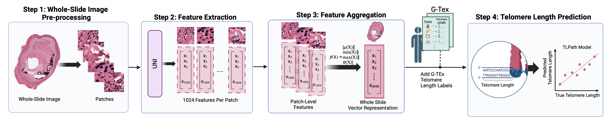

# TLPath
## Framework for predicting Telomere Length from a Whole Slide Image 

**Abstract:** Telomere dysfunction is a key hallmark of aging linked to numerous age-related diseases including cardiovascular disorders, pulmonary fibrosis, and metabolic syndromes. Despite decades of research yielding strong evidence linking telomere biology to aging processes, the field faces a critical bottleneck: current telomere measurement methods require specialized molecular techniques that prevent large-scale studies and clinical implementation. Here we present TLPath, a novel deep learning framework that extracts normal tissue architecture from routine histopathology (H&E) images to predict bulk-tissue telomere length. Trained on the Genotype-Tissue Expression cohort comprising >7.3 million patch images from >5,000 whole-slide images across 919 individuals, TLPath makes a remarkable discovery: the extracted morphological features spontaneously separate young, middle-aged, and elderly individuals within most tissue types—demonstrating for the first time that aging causes substantial architectural changes in tissues detectable without explicit age supervision. These extracted features can predict bulk-telomere length with significant accuracy (>0.51 in well-represented tissues), outperforming chronological age as a predictor (correlation = 0.20) and identifying age-discordant cases – detecting both accelerated telomeres shortening in young individuals and preserved telomeres in older individuals. Mechanistic interpretation reveals that TLPath leverages established senescence morphological markers, including nuclear-to-cytoplasmic ratio and nuclear shape variation, for its predictions. We applied TLPath in ~2,800 new GTEx biopsies where concordant with known association, the predicted telomere length is shorter across most tissues from individuals with Type 1/2 diabetes. Overall, we demonstrate that aging substantially alters tissue morphology, which TLPath captures and uses to predict telomere length, enabling large-scale telomere biology studies using existing tissue archives.	




## Installation
First clone this repo and cd into the directory: 
```
git clone https://github.com/Sinha-CompBio-Lab/TLPath.git
cd TLPath
conda env create -f env.yaml
conda activate TLPath
```
### 1. Get Access 
To pre-process and get the UNI features from the H&E slides you need access to UNI model weights. Please follow the instructions [here](https://github.com/mahmoodlab/UNI) to get access to UNI weights. For ease of reproducibility we have provided the whole slide level features which are the mean aggregated patch level features. You may find it at `{ZENODO_PLACEHOLDER}`

### 2. Running Inference
To run an inference on the UNI features please follow the guide in the notebook: `run_inference.ipynb`

### 3. Training TLPath
To train TLPath please follow the notebook: `train_TLPath.ipynb`. TLPath can also be trained via CLI. 
GTEx telomere data is publicly available and can be downloaded from: https://gtexportal.org/home/downloads/egtex/telomeres  
`python /tlpath/model.py --telomere-file /path/to/telomere.csv --features_dir /path/to/features --output-dir /path/to/output --config /path/to/config.yaml --tissues-to-skip Tissue1 Tissue2`

- `--telomere-file` → Path to the telomere length data CSV file.
- `--features_dir` → Directory containing patch features.
- `--output-dir (optional)` → Directory to save results and models. (default: results/TLPath)
- `--config (optional)` → Path to a YAML configuration file.
- `--tissues-to-skip (optional)` → List of tissues to exclude from analysis. (default: None)
